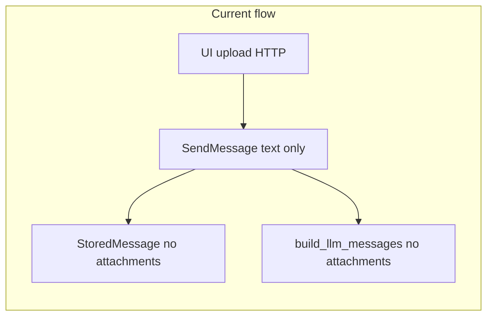
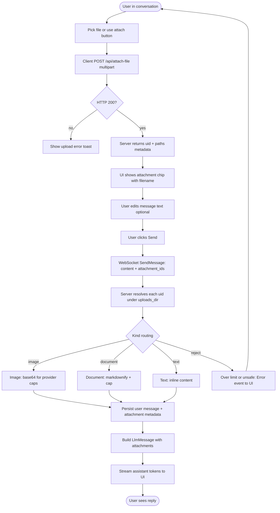
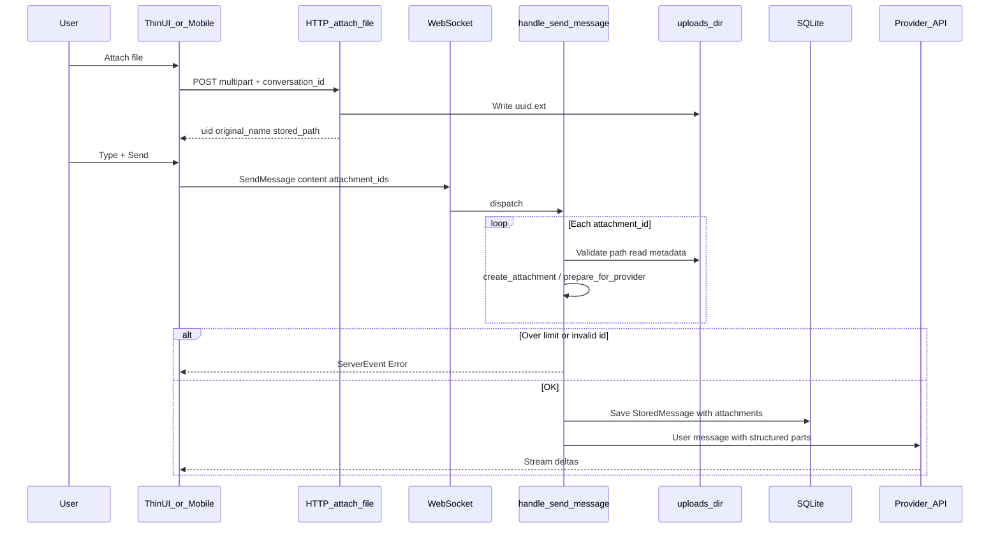

# Attachments (re)implementation plan

## What similar projects do

### OpenClaw (primary reference)

From public issues/PRs around their gateway and channels:

- **Normalized inbound model**: A proposed `InboundAttachment`-style shape (provider, kind e.g. image vs document, `fileName`, `mimeType`, `sizeBytes`, optional `providerFileId`, `localPath`, download state) so Slack/Discord/Telegram/WebChat do not each invent ad hoc strings ([issue #41657](https://github.com/openclaw/openclaw/issues/41657)).
- **Gateway parsing** (`parseMessageWithAttachments`-style): validate payload, sniff MIME, **enforce size caps** (commonly ~5 MB default in discussions), and route by kind. A known pain point: **non-image attachments were filtered or mishandled** (silent drop in `chat.send`, or binary injected as raw text) — the community direction is **explicit routing**: images → vision/multimodal blocks; documents → document APIs or extracted text; never dump opaque binary into the prompt ([issues #48123](https://github.com/openclaw/openclaw/issues/48123), [#33320](https://github.com/openclaw/openclaw/issues/33320)).
- **Security**: For URL-based images in chat-completions-style flows, **SSRF controls** for remote URLs show up in related PRs — anything that resolves paths/URLs must be allowlisted or local-only.

**Adaptation for LunaAI**: We have a single primary channel (your UI + WebSocket), not Slack — so we do not need multi-provider IDs on day one, but we **should** adopt the same **internal** schema: stable id, kind, mime, size, storage path, optional extracted text / base64-for-API, and clear errors instead of silent drops.

### IronClaw / nearai

Public descriptions emphasize **sandboxed tools**, **WASM**, and a **workspace filesystem** rather than a documented attachment wire format. Useful pattern for us: **large or sensitive files** can stay on disk and be referenced for **tool-based** reads (read_file / workspace) instead of always inlining into context — worth an optional second path after the core inline pipeline works.

---

## Current state in LunaAI (gap analysis)


| Layer              | Today                                                                                                                                                                                                                                                                                                             |
| ------------------ | ----------------------------------------------------------------------------------------------------------------------------------------------------------------------------------------------------------------------------------------------------------------------------------------------------------------- |
| **Types**          | `[Attachment](src/llm/mod.rs)` and `Message.attachments` exist; tokenizer counts them.                                                                                                                                                                                                                            |
| **Providers**      | `[openai.rs](src/llm/openai.rs)` builds multimodal `content` arrays (text + `image_url` data URLs when `attachment.content` holds base64). `[anthropic.rs](src/llm/anthropic.rs)` / `[gemini.rs](src/llm/gemini.rs)` mostly add **text placeholders** for images instead of native image blocks (technical debt). |
| **Ingestion**      | `[file_utils::create_attachment](src/llm/file_utils.rs)` can classify files, markdownify documents, and set `content` for text — but **images set `content: None`** while OpenAI expects base64 in `content` for the data URL path → **vision path is broken unless something else base64-encodes**.              |
| **Wire + handler** | `[ClientCommand::SendMessage](src/server/dto.rs)` carries **only `content: String`**. `[handle_send_message](src/server/handlers.rs)` builds `LlmMessage::new(Role::User, content)` — **no attachments**.                                                                                                         |
| **Clients**        | [luna_thin_ui `chat.rs](luna_thin_ui/src/ui/handlers/chat.rs)` and [mobile `attachFile](mobile_app/lib/application/app_controller.dart)`: upload via HTTP → send a **template string** with path — the model never receives structured attachments.                                                               |
| **Persistence**    | **SQLite** `[Message](src/storage/sqlite_storage_simple.rs)` is the source of truth for chat; `[StoredMessage](src/storage/conversation_storage.rs)` is mapped from it in `[storage_wrapper](src/storage/storage_wrapper.rs)`. Neither carries attachments; `[MessageView::from](src/server/dto.rs)` hardcodes `attachments: None`. Reload loses attachment semantics. **Important:** extend `MessageConverter::db_to_llm` so restored rows populate `LlmMessage.attachments` (not only `StoredMessage` serde). |





---

## Target architecture

### 1. Canonical attachment record (OpenClaw-inspired, Luna-scoped)

Introduce a small **serializable** type (name can stay `Attachment` or split into `AttachmentRef` + resolved `ResolvedAttachment`) with at least:

- `id` (UUID from upload — aligns with existing `[attach_file_handler](src/server/http.rs)` `uid`)
- `original_name`, `mime_type`, `size_bytes`, `kind` (enum: `Image`, `Text`, `Document`, `Other`)
- `storage_path` (server-local; never trust client paths)
- Optional: `text_extract` or `content_base64` depending on policy (see below)

**Policy (avoid OpenClaw’s failure modes):**

- **Size limits** per kind at resolve time (configurable defaults).
- **No binary in plain `Message.content`** — only structured blocks or extracted text.
- **Reject or quarantine** unknown huge binaries with a clear `ServerEvent::Error` / user-visible message, not silent drop.

### 2. Wire protocol

Extend `SendMessage` to carry optional attachment references, e.g.:

```rust
SendMessage {
  conversation_id: Option<String>,
  content: String,
  attachment_ids: Option<Vec<String>>, // UUIDs returned by POST /api/attach-file
}
```

Alternative: send `stored_path` — **prefer ids** so the server validates existence under `uploads_dir` and avoids path injection.

Server-side **resolve** step: for each id, load metadata from disk (or a small uploads index table if you add one), run `create_attachment` / enriched pipeline, produce `Vec<Attachment>` for the LLM message.

### 3. Server pipeline

1. **Upload** (existing): keep writing to `config_dir/uploads/{conversation}/{uuid}.{ext}`.
2. **On send**: resolve ids → build `Vec<Attachment>` → `Message::new_with_attachments` (or merge into user message).
3. **Image handling**: extend `[create_attachment](src/llm/file_utils.rs)` (or a sibling `prepare_for_provider`) to **base64-encode images** into `content` when the chosen backend needs inline data URLs, with a **max size** check.
4. **Documents**: keep markdownify path; optionally cap extracted markdown length with truncation + notice in text part.
5. **Persistence**: add `attachments` (JSON column or equivalent) to **SQLite `Message`** + migration in `[sqlite_storage_simple.rs](src/storage/sqlite_storage_simple.rs)`; propagate to `StoredMessage` in `[storage_wrapper.rs](src/storage/storage_wrapper.rs)` when building `FileConversation`; update **`MessageConverter::db_to_llm`** so user/tool paths restore `LlmMessage.attachments` (used by `[build_llm_messages](src/server/handlers.rs)`). Any `add_message_to_conversation` / insert helpers must round-trip the new field.
6. **DTO / UI**: populate `MessageView.attachments` from storage; thin UI / mobile can show chips/icons without relying on parsing the template string.

### 4. Provider alignment (second phase inside same effort)

- **OpenAI-compatible**: already closest — ensure image branch receives base64; add **mime** handling for `text/markdown` after conversion.
- **Anthropic**: replace image placeholders with real **image** content blocks where the API supports them (and text for markdown); align with Claude “document” vs “image” expectations.
- **Gemini**: map images to inline `inline_data` parts per their API, not placeholder strings.

### 5. Optional: “workspace / tool” path (IronClaw-style)

For very large files: store file, pass **short reference + tool instruction** (agent reads via allowed tool) instead of full inline — can be a profile flag or size threshold. Defer until inline path is correct.

---

## User flow (new)

End-to-end journey from the user’s perspective, aligned with the target protocol (`attachment_ids` + optional text).

### Step-by-step (happy path)



### Sequence (client, server, storage, model)



### Failure / edge paths (same diagram, mental model)

- **Upload fails**: user stays on draft; no `attachment_ids` sent until retry.
- **Send with unknown or tampered id**: server returns **error** (no silent drop).
- **File too large after policy**: resolve step fails before LLM; user message may still be saved without that attachment depending on product choice — document the chosen behavior in implementation.

---

## Implementation order (practical phases)

1. **Schema + persistence**: `StoredMessage` + DB migration + serde; `MessageView` and `rebuild_llm_messages` correctness.
2. **Protocol + handler**: extend `SendMessage`, implement resolve-by-upload-id in `handle_send_message`, call `file_utils` / image base64 fix.
3. **Clients**: luna_thin_ui + mobile — after upload, send `attachment_ids` with user text; stop relying on the long template string as the only carrier (optional short human text remains fine).
4. **Providers**: tighten OpenAI; upgrade Anthropic/Gemini from placeholders to real multimodal blocks where applicable.
5. **Hardening**: centralized limits, logging, user-visible errors; optional SSRF if you ever accept URLs.

---

## Key files to touch

- `[src/server/dto.rs](src/server/dto.rs)` — `SendMessage`, `MessageView`, persistence-facing types
- `[src/server/handlers.rs](src/server/handlers.rs)` — resolve attachments on send; persist
- `[src/server/http.rs](src/server/http.rs)` — optionally return/accept only safe ids; optional GET metadata
- `[src/storage/conversation_storage.rs](src/storage/conversation_storage.rs)` + `[sqlite_storage_simple.rs](src/storage/sqlite_storage_simple.rs)` — storage
- `[src/llm/file_utils.rs](src/llm/file_utils.rs)` — image base64 + limits
- `[src/llm/openai.rs](src/llm/openai.rs)`, `[anthropic.rs](src/llm/anthropic.rs)`, `[gemini.rs](src/llm/gemini.rs)` — provider mapping
- `[luna_thin_ui/.../chat.rs](luna_thin_ui/src/ui/handlers/chat.rs)`, `[mobile_app/.../app_controller.dart](mobile_app/lib/application/app_controller.dart)` — wire `attachment_ids`
- `[luna_thin_ui/src/server/dto.rs](luna_thin_ui/src/server/dto.rs)` — keep `ClientCommand::SendMessage` in **sync** with server `dto` (duplicate types today)

---

## Gaps and improvements (agentic review)

Corrections and items that were implicit or missing from the first draft:

| Gap | Why it matters | Recommendation |
| --- | --- | --- |
| **Wrong rebuild name** | Implementers will grep for a non-existent symbol. | Use **`build_llm_messages`** + **`MessageConverter::db_to_llm`** as the reload path ([handlers.rs](src/server/handlers.rs), [message_converter.rs](src/services/message_converter.rs)). |
| **SQLite vs file `StoredMessage`** | Chat persistence is SQLite-first; wrapper maps to `StoredMessage` for API views. | Migrate **`sqlite_storage_simple::Message`**, then mapper + converter; do not only touch JSON file types. |
| **Authorization on `attachment_id`** | Guessing another conversation’s upload UUID could exfiltrate files. | Resolve only if **`(conversation_id, upload_id)`** matches upload metadata on disk (or index table): same conversation as `SendMessage`, path under `uploads_dir/{conversation}/`. |
| **Failure behavior on resolve** | Plan deferred “save message without attachment vs fail send”. | **Pick one explicitly:** e.g. *fail the send* with `ServerEvent::Error` and do not persist partial user message (simplest UX/debugging); or *persist text-only* and surface warning — document in handler. |
| **Multipart ordering** | Some models are sensitive to image vs text order. | Define stable order: e.g. **user text first, then images**, or follow OpenAI/Anthropic docs; add one sentence in provider code. |
| **Summarization window** | `build_llm_messages` slices from latest summary; summarized user rows may drop attachment context. | Decide: attachments on summarized messages are **lost from LLM context** by design (acceptable) vs **copy key refs into summary** (hard) — at minimum document. |
| **Orphan uploads** | Files on disk without a committed message. | Optional follow-up: TTL cleanup job or manual GC; not blocking MVP but avoids disk leak. |
| **Backward compatibility** | Old clients send text-only `SendMessage`. | `attachment_ids: Option<_>` remains optional; no breaking change. |
| **Security beyond size** | Size caps alone are insufficient. | **Magic-byte / MIME** validation at upload or resolve; reject **symlinks** under uploads; path stays server-built (already aligned with id-based resolve). |
| **Testing** | Success criteria are manual. | Add: unit tests for resolve + cap rejection; one integration test: upload → send → `db_to_llm` includes attachments; optional PNG vision smoke. |
| **Observability** | Debugging “silent” failures. | Structured log fields: `attachment_id`, `conversation_id`, `reject_reason` (too_large, bad_mime, not_found, wrong_conversation). |
| **Duplicate conversion** | `[types.rs](src/types.rs)` implements `From<&StorageMessage> for LlmMessage` while `MessageConverter::db_to_llm` is the real path. | When adding attachments, **either** extend both and keep parity **or** consolidate on one converter and delete the other to avoid drift. |

**External references:** Verify OpenClaw issue links still resolve (numbers look like placeholders); treat as conceptual only if links 404.

---

## Success criteria

- Upload + send yields **vision-capable** image input on OpenAI-compatible backends (verified with a small PNG).
- Conversation reload shows **same attachment metadata** and replay sends consistent LLM payloads.
- Large/binary files never fill the prompt as garbage; user gets a **clear error** or tool-based path.
- No silent drop of non-image attachments (OpenClaw lesson).
- **Reload path:** `MessageConverter::db_to_llm` produces the same attachment-bearing `LlmMessage`s as a fresh send (parity check).

