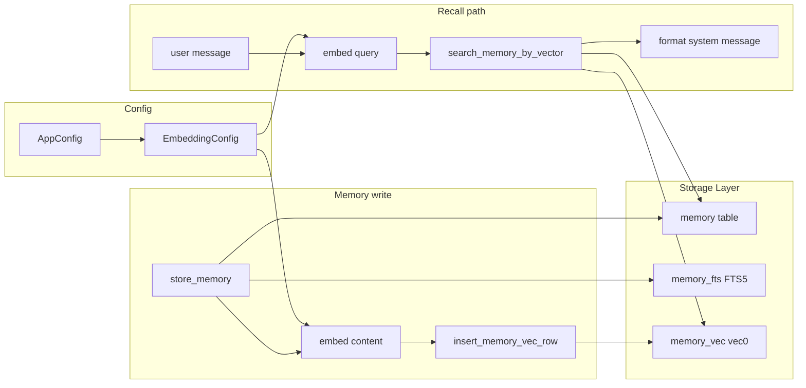

# Long-term memory enhancement with sqlite-vec

## Scope

- **Recall path** (automatic injection on each user message): vector-only via sqlite-vec; no FTS5, no merge.
- **Tools** (`search_memory`, `search_memory_by_category`) and **deep sleep** dedup: keep using existing FTS5 so no change to agent tools or deep sleep logic.
- **Config**: new section for embedding model (endpoint, model name, dimensions, API key).
- **CRUD**: on memory create/update/delete, maintain the new vec table using an external embedding model.

---

## 1. Embedding config

**File:** [src/config/mod.rs](src/config/mod.rs)

- Add a new struct (e.g. `EmbeddingConfig`) with:
  - `enabled: bool` (default `false` so existing installs are unchanged)
  - `endpoint: String` (e.g. OpenAI-compatible embeddings URL)
  - `model: String`
  - `dimensions: usize` (e.g. 1536; must match vec column size)
  - `api_key: Option<String>` (or use env)
- Add `embedding: Option<EmbeddingConfig>` to `AppConfig` (or a top-level `[embedding]` section), with `Default` leaving it `None`/disabled.
- No need to change `ResolvedProfile` or LLM presets; embedding is a separate, optional service.

---

## 2. Embedding client (trait + one implementation)

**New module:** e.g. `src/embeddings/mod.rs` (or `src/embedding.rs`).

- Define a small trait, e.g. `EmbeddingProvider: Send + Sync` with a single method: `fn embed(&self, text: &str) -> Result<Vec<f32>, E>` (or async if you use reqwest).
- Implement one provider that calls an HTTP API (OpenAI-compatible embeddings: POST to endpoint with `input` and `model`; parse `data[0].embedding`). Use existing `reqwest` from the crate; keep it simple (no new deps if possible).
- Build the provider from `EmbeddingConfig` at startup; if `embedding` is `None` or disabled, the recall path will not call it (see below).

---

## 3. sqlite-vec dependency and DB setup

**File:** [Cargo.toml](Cargo.toml)

- Add: `sqlite-vec = "0.1"` (or the version that provides `sqlite3_vec_init` and vec0; confirm on [crates.io](https://crates.io/crates/sqlite-vec)).

**File:** [src/storage/sqlite_storage_simple.rs](src/storage/sqlite_storage_simple.rs)

- **Connection open:** After `Connection::open` in `new_with_settings`, load the sqlite-vec extension before any schema init. With rusqlite 0.34+, use `register_auto_extension` and `sqlite_vec::sqlite3_vec_init` (see [this approach](https://gist.github.com/rectalogic/592400b7bb8f75c9618f66218f9143f3)). If loading fails (e.g. extension not linked), log a warning and proceed without vec; vec-dependent code will be gated by config.
- **Schema:** In `init_database`, after the existing `memory` and `memory_fts` setup, add creation of the vec virtual table only when embedding is configured (see below). Alternatively create the table unconditionally with a fixed dimension (e.g. 1536) and document that dimension must match config; then embedding config validation can reject mismatches.
- **Vec table:** `CREATE VIRTUAL TABLE IF NOT EXISTS memory_vec USING vec0(embedding float[N]);` where N is the configured dimension. sqlite-vec uses `rowid`; align with `memory.id`: insert/update/delete by `rowid` = memory id.

**Dimension handling:** Either pass embedding dimension from config into storage init (so `SqliteStorage` or `Storage` is created with knowledge of whether vec is enabled and which dimension), or create the vec table with a fixed default (e.g. 1536) and validate at runtime that `EmbeddingConfig.dimensions` matches. Recommend: create vec table only when embedding config is present and dimensions are set; then storage layer needs either a one-time "enable vec with dimension" or the table is created in a migration that runs when the app starts with embedding enabled.

**Practical approach:** Add an optional `embedding_dimension: Option<usize>` to `SqliteSettings` (or a separate struct passed into `Storage::new_with_settings`). When `Some(dim)`, after opening the connection and loading the extension, run `CREATE VIRTUAL TABLE IF NOT EXISTS memory_vec USING vec0(embedding float[dim]);`. So the caller (server startup) reads `AppConfig::embedding`, and if enabled, passes the dimension into storage construction; otherwise passes `None` and the vec table is never created (and vec methods no-op or return empty).

---

## 4. Memory CRUD and vec table maintenance

**File:** [src/storage/sqlite_storage_simple.rs](src/storage/sqlite_storage_simple.rs)

- **store_memory:** Today it only inserts into `memory` and the FTS trigger fills `memory_fts`. Add: if vec is enabled, call an optional callback or accept an optional `embedding: Option<Vec<f32>>` from the caller. Prefer: storage does not call the embedding service (to avoid async in storage). So the **caller** of `store_memory` (loop_engine for tool, deep_sleep_service for batch) must compute the embedding and pass it in. New signature: e.g. `store_memory(..., embedding: Option<&[f32]>)`; if `Some`, after insert into `memory`, insert into `memory_vec(rowid, embedding) VALUES (last_insert_rowid(), ?)`. So all call sites that create memory need to optionally pass the embedding (tool call and deep sleep).
- **update_memory:** Similarly, accept optional `embedding: Option<&[f32]>`; if provided, after updating `memory`, replace the row in `memory_vec` for that id (delete then insert, or update if the extension supports it).
- **delete_memory:** After `DELETE FROM memory`, run `DELETE FROM memory_vec WHERE rowid = ?` for that id (and ensure FTS trigger still runs for memory; it does today).

**Alternative (cleaner separation):** Storage exposes only: `insert_memory_vec_row(id: i64, embedding: &[f32])`, `update_memory_vec_row(id: i64, embedding: &[f32])`, `delete_memory_vec_row(id: i64)`, and `search_memory_by_vector(embedding: &[f32], limit: usize) -> Vec<MemoryEntry>`. Then a higher-level service (or the same places that call store_memory) is responsible for: when creating/updating a memory, calling the embedding provider and then calling `insert_memory_vec_row` / `update_memory_vec_row`. That keeps storage synchronous and free of HTTP. So:

- **store_memory** stays as today (no embedding param); after the caller calls `store_memory`, the caller (or a small “memory service”) calls `embed(content)` and then `storage.insert_memory_vec_row(entry.id, &embedding)`.
- **update_memory** same: caller updates memory, then embeds new content and calls `storage.update_memory_vec_row(id, &embedding)`.
- **delete_memory** inside storage: after deleting from `memory`, delete from `memory_vec` where rowid = id.

So the only change inside storage for “write” is: in `delete_memory` add the `memory_vec` delete; and add the three vec methods. The “caller” that must call the new vec methods is: (1) agentic loop_engine when handling `store_memory` tool, (2) deep_sleep_service when it stores new memories, (3) any code that calls `update_memory`. So we need a shared place that has access to both storage and the embedding provider: e.g. a thin `MemoryService` that has `store_memory_with_embedding(&self, content, category, importance)` which calls `embed(content)`, then `storage.store_memory(...)`, then `storage.insert_memory_vec_row(id, &emb)`. That service is used from the server handler / loop_engine and from deep_sleep. For the **server** path, the handler currently doesn’t call store_memory (the agent does via tools). So the only call sites for store_memory are loop_engine and deep_sleep_service. So we need:

- **loop_engine:** When executing `store_memory` tool, after `guard.store_memory(...)`, if embedding is configured, get embedding for content and call a new method on storage to insert into memory_vec. So loop_engine needs a reference to the embedding provider (or to a MemoryService that has both storage and embedding). That implies ServerContext (or session) holds an optional embedding provider, and when the loop executes the store_memory tool it uses that provider and then updates the vec.
- **deep_sleep_service:** Same: when it calls `guard.store_memory(...)`, after that it should call embed(proposal.content) and insert_memory_vec_row. So deep_sleep needs an embedding provider too; it’s created with storage and optionally embedding config.

So the flow is: **Storage** has sync methods: `insert_memory_vec_row`, `update_memory_vec_row`, `delete_memory_vec_row` (called from delete_memory internally), and `search_memory_by_vector`. **Callers** (loop_engine, deep_sleep) that create or update memories must call the embedding provider then the vec insert/update. So we need to pass an optional embedding provider into loop_engine (or into the tool execution context) and into deep_sleep_service. That’s the cleanest.

---

## 5. Recall path: vector-only retrieval

**File:** [src/services/memory_rag.rs](src/services/memory_rag.rs)

- **Current:** `retrieve_memory_context(storage, user_message, used_ids)` uses `extract_keywords` and `storage.search_memory(keywords, limit)` (FTS5), then filters by `used_ids`, formats a system message, returns `Option<(String, Vec<i64>)>`.
- **New:** Make the function async: `retrieve_memory_context(storage, user_message, used_ids, embedding_provider: Option<&dyn EmbeddingProvider>)`. If `embedding_provider` is `None`, return `None` (no memory recall when embedding is not configured). Otherwise: call `embedding_provider.embed(user_message).await`, then `storage.search_memory_by_vector(&query_embedding, limit)` (sync, storage already locked). Use the returned memory ids, filter by `used_ids`, load full entries if needed (storage can return `Vec<MemoryEntry>` from `search_memory_by_vector`), format the same system message as today, return `Some((message, new_ids))`. Remove use of `extract_keywords` and `search_memory` in this path.
- **Handler:** In [src/server/handlers.rs](src/server/handlers.rs) (around line 460), the call to `retrieve_memory_context` currently passes `&storage_guard` and `used_ids`. Add the embedding provider from `ServerContext` (e.g. `ctx.embedding_provider`). So `ServerContext` gets an optional `embedding_provider: Option<Arc<dyn EmbeddingProvider>>`. The handler then calls `memory_rag::retrieve_memory_context(&storage_guard, &content, used_ids, ctx.embedding_provider.as_deref()).await`. So `retrieve_memory_context` must be `async` and the handler already in an async context.

---

## 6. Storage API for vec

**File:** [src/storage/sqlite_storage_simple.rs](src/storage/sqlite_storage_simple.rs)

- **search_memory_by_vector(&[f32], limit)** -> `SqliteResult<Vec<MemoryEntry>>`: run `SELECT rowid, distance FROM memory_vec WHERE embedding MATCH ? ORDER BY distance LIMIT ?`; then for each rowid (memory id), load the row from `memory` table and build `MemoryEntry`. If the vec table doesn’t exist (extension not loaded or vec disabled), return `Ok(vec![])` or an error; document that this is only used when embedding is enabled.
- **insert_memory_vec_row(id, &[f32])**: `INSERT INTO memory_vec(rowid, embedding) VALUES (?, ?)`. Bind the float slice in the format sqlite-vec expects (see crate docs; often a JSON array string or packed bytes).
- **update_memory_vec_row(id, &[f32])**: delete the row with that rowid, then insert (or use extension update if available).
- **delete_memory:** add `DELETE FROM memory_vec WHERE rowid = ?` before or after deleting from `memory` (and let FTS trigger handle memory_fts).

**File:** [src/storage/storage_wrapper.rs](src/storage/storage_wrapper.rs)

- Expose the same methods on `Storage` (delegate to sqlite).

---

## 7. Wiring embedding provider and optional vec table creation

**Startup (server):**

- In [src/server/mod.rs](src/server/mod.rs), after loading config and before creating `ServerContext`: if `config.embedding` is `Some` and enabled, build the embedding client (e.g. `Arc<dyn EmbeddingProvider>`) and pass the embedding dimension into storage. So storage must be created with “vec enabled + dimension” when embedding config exists. That implies: `Storage::new_with_settings(db_path, settings, embedding_dimension: Option<usize>)`. When `Some(dim)`, `SqliteStorage::new_with_settings` loads the extension and creates `memory_vec` with `float[dim]`.
- Set `ServerContext.embedding_provider` to that `Arc<dyn EmbeddingProvider>` (or `None`).

**Loop engine (store_memory tool):**

- When the agent calls `store_memory`, the tool handler currently does `guard.store_memory(&content, category, importance)`. After that, if an embedding provider is available (e.g. passed into the run context or via a shared context), call `embed(content)`, then `guard.insert_memory_vec_row(entry.id, &emb)`. So the “run context” or handler must have access to the embedding provider; the simplest is to pass it from `ServerContext` into the place that executes tools (handlers already have `ctx`). So in the tool execution block, after `store_memory` succeeds, get `ctx.embedding_provider.as_ref()`, and if `Some`, embed the content and call a new method on storage: `insert_memory_vec_row`. Storage is already locked there. So we need the handler to pass `embedding_provider` into the closure or the loop; currently the loop gets `storage` and `run_context`. So add optional embedding provider to `RunContext` (or to the same struct that holds persistence and storage). So `RunContext` in handlers could hold `embedding_provider: Option<Arc<dyn EmbeddingProvider>>`. When building `RunContext` for the loop, set it from `ctx.embedding_provider`. Then inside the loop engine, when handling the result of `store_memory`, the engine would need to call back or the handler that processes tool results would do the vec insert. Easiest: in **handlers.rs**, where the loop is invoked, after the loop processes the message, we don’t have a hook per tool call. So the cleanest is: **loop_engine** receives an optional `embedding_provider` in its config or context, and when it executes the `store_memory` tool and gets success, it calls the provider and then calls a new method on the storage guard: `insert_memory_vec_row`. So the storage guard (the `Storage` type) must have that method, and the loop engine must receive an optional embedding provider. So: **loop_engine** has an optional `embedding_provider: Option<Arc<dyn EmbeddingProvider>>` in the struct or in the run context passed to `process_message`. When executing the `store_memory` tool and getting back the new `MemoryEntry`, if embedding_provider is Some, embed the content and call `storage.insert_memory_vec_row(entry.id, &embedding)`. That requires the loop to have async access to the embedding (embed is async if HTTP). So the tool execution in the loop might need to be async for that branch, or we use block_on for the embed call. Prefer making the embedding client sync (e.g. blocking reqwest) or run the embed in a spawn_blocking so the loop doesn’t need to be fully async. Simplest: **embedding provider is sync** (blocking HTTP inside `embed()`), so from the loop we call `embedding_provider.embed(content)` and then `storage.insert_memory_vec_row`. The loop is currently sync (it uses `block_in_place` or runs in a blocking context). So keep the embedding client sync (blocking) and call it from the tool handler.
- **update_memory:** Today there’s no `update_memory` tool in the list; only store_memory, search_memory, search_memory_by_category, delete_memory. So we only need to add vec insert for **store_memory** in the loop. For **update_memory** (storage method): it’s called from deep_sleep_service when updating an existing memory. So in deep_sleep_service, after `guard.update_memory(...)`, if embedding provider is set, embed the new content and call `guard.update_memory_vec_row(id, &emb)`.

**Deep sleep:**

- Deep sleep service is constructed with storage; add an optional `embedding_provider: Option<Arc<dyn EmbeddingProvider>>`. When it stores a new memory (the block that does `guard.store_memory(...)`), after success, if provider is Some, call `embed(proposal.content)` and `guard.insert_memory_vec_row(entry.id, &emb)`. When it updates a memory (`guard.update_memory(...)`), after success, if provider is Some, embed new content and call `guard.update_memory_vec_row(eval.id, &emb)`.

---

## 8. Backfill (optional but recommended)

- Provide a one-off or admin path: for each row in `memory` that does not have a row in `memory_vec`, compute embedding for `content` and insert into `memory_vec`. This can be a small CLI subcommand or a server endpoint, or a migration that runs once at startup when embedding is enabled (iterate memory table, embed, insert into memory_vec skipping existing). Document that existing memories won’t be recalled until backfilled or re-saved.

---

## 9. FTS5 retention

- Keep `memory_fts` and the existing `search_memory(keywords)` and `search_memory_by_category` implementations unchanged. They are used by the **tools** and by **deep sleep** dedup. No merge in the recall path; recall uses only `search_memory_by_vector`.

---

## Data flow summary

---

## File change summary

| File                                                                         | Changes                                                                                                                                                                                                                                    |
| ---------------------------------------------------------------------------- | ------------------------------------------------------------------------------------------------------------------------------------------------------------------------------------------------------------------------------------------ |
| [Cargo.toml](Cargo.toml)                                                     | Add `sqlite-vec` dependency.                                                                                                                                                                                                               |
| [src/config/mod.rs](src/config/mod.rs)                                       | Add `EmbeddingConfig`, add `embedding` to `AppConfig`.                                                                                                                                                                                     |
| New `src/embeddings/mod.rs` (or `embedding.rs`)                              | Trait `EmbeddingProvider`, one HTTP (OpenAI-compatible) implementation.                                                                                                                                                                    |
| [src/storage/sqlite_storage_simple.rs](src/storage/sqlite_storage_simple.rs) | Load extension in `new_with_settings`; add `memory_vec` creation when dimension provided; add `insert_memory_vec_row`, `update_memory_vec_row`, `search_memory_by_vector`; in `delete_memory` delete from `memory_vec`.                    |
| [src/storage/storage_wrapper.rs](src/storage/storage_wrapper.rs)             | Add optional param for embedding dimension to constructors; expose vec methods.                                                                                                                                                            |
| [src/services/memory_rag.rs](src/services/memory_rag.rs)                     | Replace keyword/FTS retrieval with async flow: optional embed, then `search_memory_by_vector`; same output format and dedup.                                                                                                               |
| [src/server/handlers.rs](src/server/handlers.rs)                             | Pass embedding provider into `retrieve_memory_context`; add `embedding_provider` to `ServerContext`; in store_memory tool handling, after success call embed + insert_memory_vec_row (need RunContext or loop to have embedding provider). |
| [src/server/mod.rs](src/server/mod.rs)                                       | Build embedding client from config; pass embedding dimension into storage construction; set `ctx.embedding_provider`; pass embedding provider into deep sleep.                                                                             |
| [src/agentic/loop_engine.rs](src/agentic/loop_engine.rs)                     | Accept optional embedding provider in context; when executing store_memory tool and success, call embed and storage.insert_memory_vec_row.                                                                                                 |
| [src/services/deep_sleep_service.rs](src/services/deep_sleep_service.rs)     | Accept optional embedding provider; after store_memory success, embed and insert_memory_vec_row; after update_memory success, embed and update_memory_vec_row.                                                                             |

---

## Testing and docs

- Unit test: with an in-memory DB and a mock embedding (fixed vector), create memory_vec, insert a row, search by vector, assert correct memory returned.
- Document new `[embedding]` (or `embedding` section) in config and that when disabled, memory recall is skipped; document backfill for existing memories.

