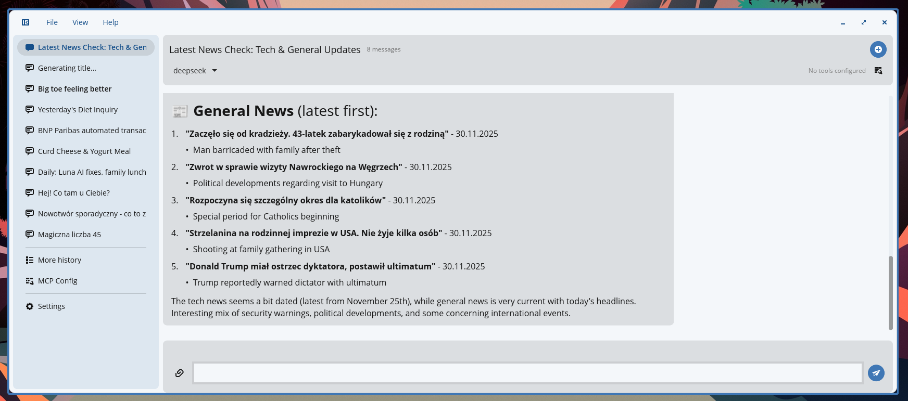
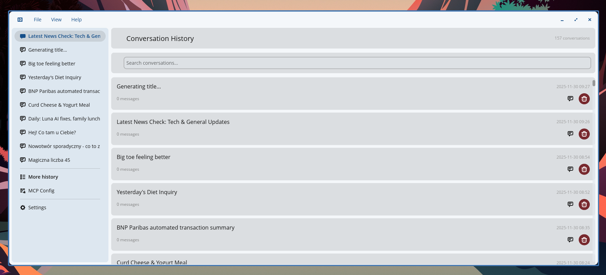
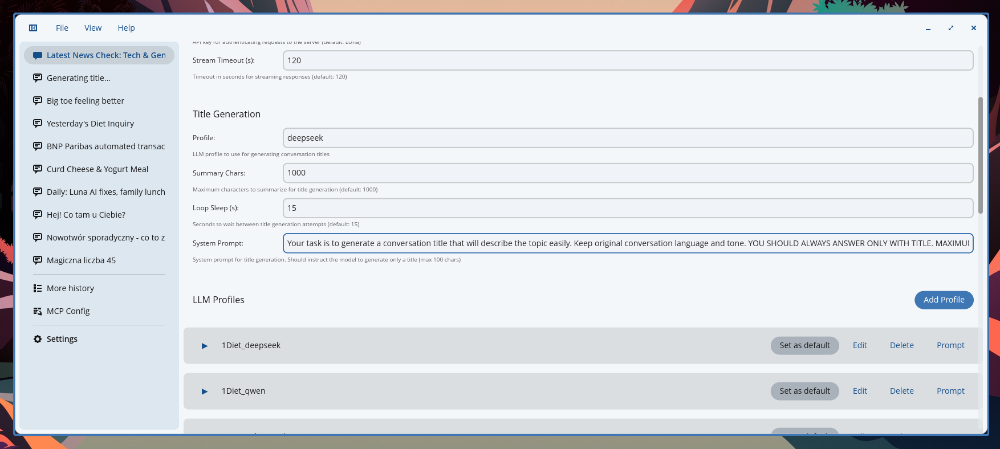
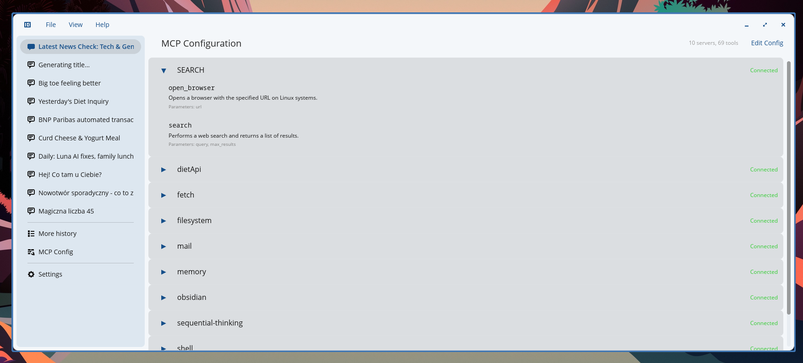
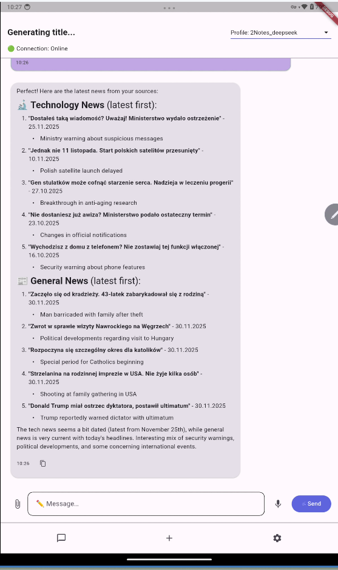
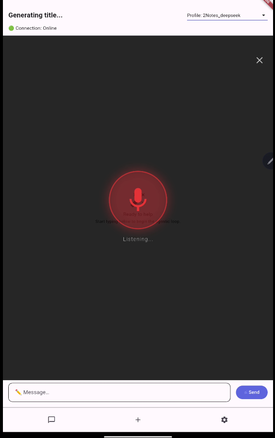
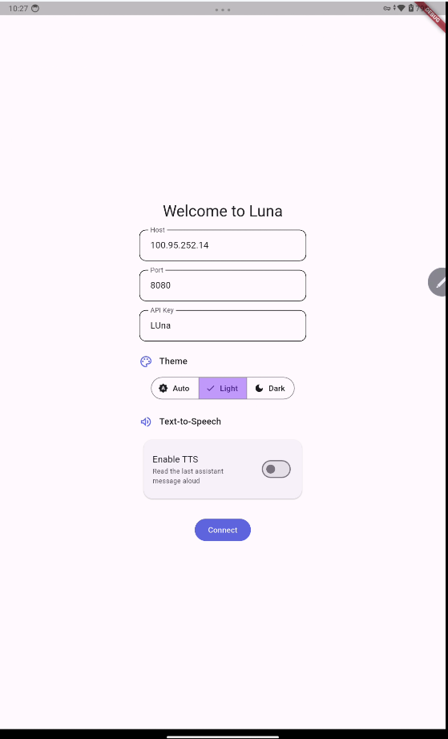

<div align="center">
  <br>
  <h1>🌙 Luna AI</h1>

  <p><strong>Your brilliant AI companion for desktop and mobile!</strong></p>
  
  <p>A modern, native application that brings powerful AI conversations to your desktop, phone, and tablet with seamless MCP integration.</p>
</div>

## ✨ What is Luna AI?

Luna AI is your intelligent companion that combines the power of modern AI with the beauty of native integration. Available on desktop and mobile, Luna brings you:

- 🤖 **Smart Conversations** - Real-time streaming responses that feel natural and engaging
- 📱 **Mobile & Desktop** - Use Luna on your phone, tablet, or desktop - all in sync
- 🔧 **MCP Superpowers** - Connect to tools and services through Model Context Protocol
- 🎨 **Beautiful Interface** - Native design that feels right at home
- 💾 **Memory Management** - Save, organize, and revisit your conversations
- 🔌 **Flexible Backends** - Support for multiple AI providers and local models

## 🚀 What Can Luna Do?

### 🎯 Core Features
- **Real-time Chat**: Watch responses stream in with smooth, non-blocking UI
- **Cross-Platform**: Desktop and mobile apps that sync seamlessly
- **Voice Mode**: Speech recognition and text-to-speech for hands-free conversations
- **Conversation History**: Never lose a brilliant idea - save and search all your chats
- **MCP Integration**: Connect to external tools, APIs, and services
- **File Attachments**: Share documents and images directly in conversations
- **Keyboard Shortcuts**: Navigate like a pro with efficient keyboard controls (desktop)
- **Thin desktop client** (`luna-thin`): COSMIC UI with selectable/copyable chat text — see [luna_thin_ui/README.md](luna_thin_ui/README.md)

### 🔧 MCP Magic
Luna ships a curated set of no-setup MCP servers out of the box:
- **Shell** – Run whitelisted shell commands (`ls`, `git`, `cargo`, …)
- **Filesystem** – Read and write files in your home directory
- **Fetch** – Retrieve any URL and get clean markdown output
- **Search** – Search the web with no API key required
- **Skills** – Agent skill system: give Luna reusable tools / playbooks
- **MarkItDown** – Convert PDFs, Word docs, and URLs to markdown
- **Luna Memory** – Persistent conversation history + semantic recall
- **Custom Tools**: Extend Luna's capabilities with your own MCP servers

### 💡 Examples of What You Can Do

```bash
# Ask Luna to help with programming
"Write a Rust function that sorts a vector of integers"

# Get real-time information
"What's the current weather in Warsaw?"

# File management
"Read the contents of my project's README file"

# Email tasks
"Send an email to my team about the project update"

# Web research
"Find the latest news about AI developments"

# Task management
"Add 'fix the bug in login module' to my todo list"
```

## 🔌 Supported Backends

Luna AI supports multiple AI providers, giving you flexibility and choice:

### 🌐 Cloud Providers
- **OpenAI** – GPT-5, GPT-4.1, and other OpenAI models
- **Anthropic** – Claude Sonnet / Opus 4.x
- **Google** – Gemini 2.5 Flash / Pro
- **DeepSeek** – DeepSeek Chat V3.2 / Reasoner
- **OpenRouter** – 100+ models through a single API key

### 💻 Local Models
- **Ollama** – Run local models like Llama, Mistral, Phi, and more
- **Any OpenAI-compatible endpoint** – point Luna at any local or self-hosted API

### 🔧 Configuration
Run the interactive setup wizard to configure everything in one go:
```bash
cd quick_setup && pip install -e . && luna-quick-setup
```
Full config reference: [quick_setup/docs/QUICK_SETUP.md](quick_setup/docs/QUICK_SETUP.md)

## 🛠️ Installation

### Desktop Application

#### Building from Source
```bash
git clone https://github.com/digit1024/LunaAI.git
cd LunaAI
./install-deps.sh          # install build dependencies (Pop OS / Ubuntu)
unset ARGV0 && cargo build --release
```

#### Quick Setup (recommended first step)
```bash
cd quick_setup
pip install -e .
luna-quick-setup           # interactive one-shot configuration
```

#### Running
```bash
unset ARGV0 && cargo run --release
```

#### Running as Server
Run Luna in server mode to access it from mobile devices and other clients:
```bash
unset ARGV0 && cargo run --release -- --server
```

#### Thin desktop client (COSMIC)
```bash
unset ARGV0 && cargo run -p luna_thin_ui
```

### Mobile App

The mobile app is available in the `mobile_app/` directory. Built with Flutter, it connects to the desktop server via WebSocket.

See the [Mobile App README](mobile_app/README.md) for installation instructions.

### Telegram bridge
Talk to Luna from Telegram: set `TELEGRAM_BOT_TOKEN`, `LUNA_ADDRESS`, and `LUNA_API_KEY`, then run `python telegram_bridge.py`. Optional: `ALLOWED_TELEGRAM_IDS=123,456` restricts the bot to those Telegram user IDs (comma-separated); if unset, anyone can use the bot. Commands in chat: `/new`, `/new {profile}`, `/profile {profile}`.

## 🏗️ Architecture

Luna AI is built with modern technologies:

- **Desktop**: Rust with COSMIC desktop framework for native integration
- **Mobile**: Flutter for cross-platform mobile support (Android, iOS)
- **Server Mode**: HTTP/WebSocket server for multi-device access
- **tokio**: Async runtime for smooth performance
- **MCP Protocol**: Tool calling and external service integration
- **Real-time Streaming**: Live response updates across all platforms

## 📸 Screenshots

### 🖥️ Desktop

<div align="center">
  
  <p><em>Beautiful conversations on the COSMIC desktop</em></p>

  
  <p><em>Manage and revisit your conversation history</em></p>
  
  
  <p><em>Configure your AI backends and preferences</em></p>

  
  <p><em>Powerful MCP tool integration and configuration</em></p>
</div>

### 📱 Mobile

<div align="center">
  
  <p><em>Chat with Luna on the go</em></p>

  
  <p><em>Voice mode for hands-free conversations</em></p>
  
  
  <p><em>Mobile settings and configuration</em></p>
</div>

## 🤝 Contributing

We welcome contributions! Whether it's bug reports, feature requests, or code contributions, feel free to:
- Open an issue
- Submit a pull request
- Join the discussion

## 📄 License

MIT License - Feel free to use, modify, and distribute!

---

<div align="center">
  <p><strong>Ready to experience intelligent desktop computing?</strong></p>
  <p>Clone the repo and start chatting with Luna today! 🚀</p>
</div>
