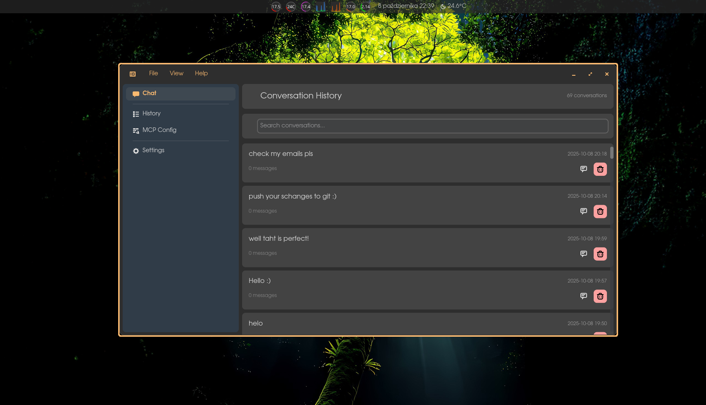

<div align="center">
  <br>
  <h1>🌙 Luna AI</h1>

  <p><strong>Your brilliant AI companion for the COSMIC™ desktop!</strong></p>
  
  <p>A modern, native desktop application that brings powerful AI conversations right to your desktop with seamless MCP integration.</p>

  <a href='https://github.com/digit1024/LunaAI/releases'>
    
  </a>
</div>

## ✨ What is Luna AI?

Luna AI is your intelligent desktop companion that combines the power of modern AI with the beauty of native desktop integration. Built specifically for the COSMIC desktop environment, Luna brings you:

- 🤖 **Smart Conversations** - Real-time streaming responses that feel natural and engaging
- 🔧 **MCP Superpowers** - Connect to tools and services through Model Context Protocol
- 🎨 **Beautiful Interface** - Native COSMIC design that feels right at home
- 💾 **Memory Management** - Save, organize, and revisit your conversations
- 🔌 **Flexible Backends** - Support for multiple AI providers and local models

## 🚀 What Can Luna Do?

### 🎯 Core Features
- **Real-time Chat**: Watch responses stream in with smooth, non-blocking UI
- **Conversation History**: Never lose a brilliant idea - save and search all your chats
- **MCP Integration**: Connect to external tools, APIs, and services
- **Keyboard Shortcuts**: Navigate like a pro with efficient keyboard controls

### 🔧 MCP Magic
Luna's MCP integration opens up a world of possibilities:
- **File Operations**: Read, write, and manage files directly from conversations
- **Web Search**: Fetch real-time information from the internet
- **Email Management**: Send, receive, and organize emails
- **Task Management**: Integrate with your todo lists and productivity tools
- **Custom Tools**: Extend Luna's capabilities with your own MCP servers

### 💡 Examples of What You Can Do

```bash
# Ask Luna to help with programming
"Write a Rust function that sorts a vector of integers"

# Get real-time information
"What's the current weather in Warsaw?"

# File management
"Read the contents of my project's README file"

# Email tasks
"Send an email to my team about the project update"

# Web research
"Find the latest news about AI developments"

# Task management
"Add 'fix the bug in login module' to my todo list"
```

## 🔌 Supported Backends

Luna AI supports multiple AI providers, giving you flexibility and choice:

### 🌐 Cloud Providers
- **OpenAI** - GPT-4, GPT-3.5, and other OpenAI models
- **Anthropic** - Claude models with advanced reasoning
- **Google** - Gemini models and Google AI services
- **Azure OpenAI** - Enterprise-grade OpenAI deployments

### 💻 Local Models
- **Ollama** - Run local models like Llama, Mistral, and more
- **Custom endpoints** - Connect to any OpenAI-compatible API

### 🔧 Configuration
Easily switch between backends in the settings or configure multiple providers for different use cases. See the [Configuration Guide](docs/configuration.md) for detailed setup instructions.

## 🛠️ Installation

### Building from Source
```bash
git clone https://github.com/digit1024/LunaAI.git
cd LunaAI
cargo build
```

### Running
```bash
cargo run
```

## 🏗️ Architecture

Luna AI is built with modern Rust and the COSMIC desktop framework:

- **libcosmic**: Native desktop integration
- **tokio**: Async runtime for smooth performance
- **MCP Protocol**: Tool calling and external service integration
- **Real-time Streaming**: Live response updates

## 📸 Screenshots

<div align="center">
  
  <p><em>Agentic capabilities with MCP!</em></p>

  
  <p><em>Manage and revisit your conversation history</em></p>
  
  
  <p><em>Configure your AI backends and preferences</em></p>

  
  <p><em>Powerful MCP tool integration and configuration</em></p>
</div>

## 🤝 Contributing

We welcome contributions! Whether it's bug reports, feature requests, or code contributions, feel free to:
- Open an issue
- Submit a pull request
- Join the discussion

## 📄 License

MIT License - Feel free to use, modify, and distribute!

---

<div align="center">
  <p><strong>Ready to experience intelligent desktop computing?</strong></p>
  <p>Clone the repo and start chatting with Luna today! 🚀</p>
</div>
