# Memory System Flows

Request and background flows with sequence and flowchart diagrams.

---

## 1. Memory RAG injection (per user message)

On every `SendMessage`, after building LLM messages and injecting system prompts, the server retrieves relevant memories and injects them as one system message. Recalled IDs are persisted so the same memory is not re-injected in the same conversation (and dedup survives restarts).

### Sequence diagram

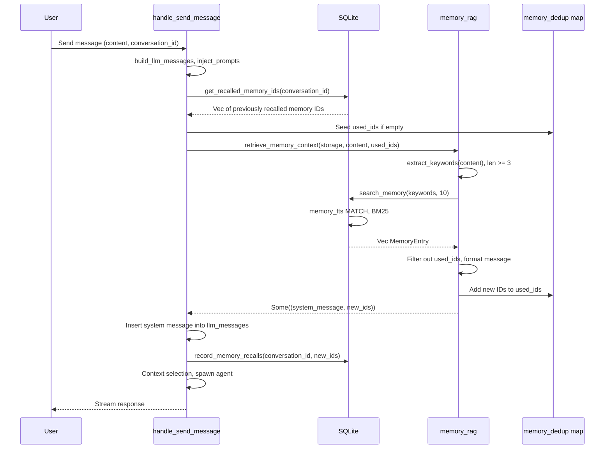

### Flowchart (RAG internals)

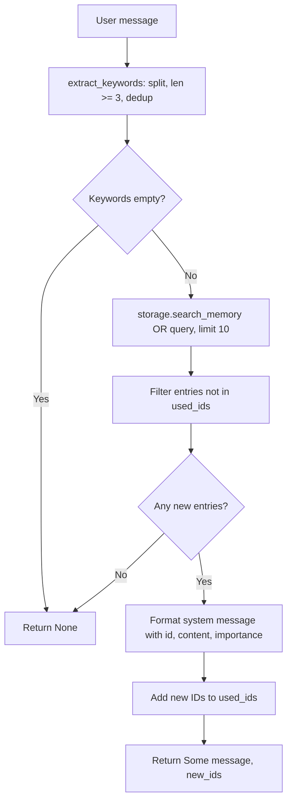

---

## 2. Recording and loading recalls

Recalls are written when Memory RAG injects memories; they are read when the dedup set for that conversation is empty (e.g. first message after server restart).

### Write path

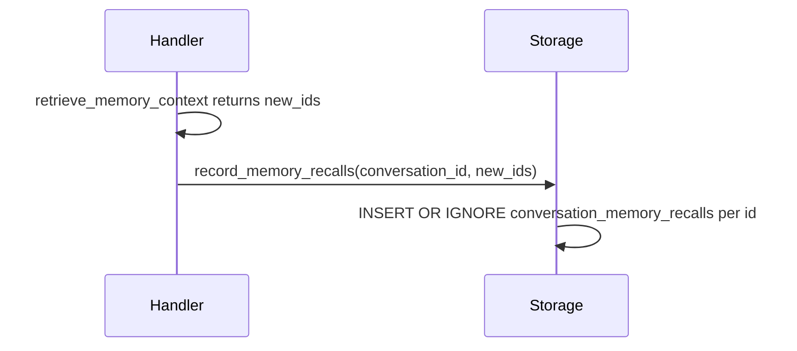

### Read path (seed dedup)

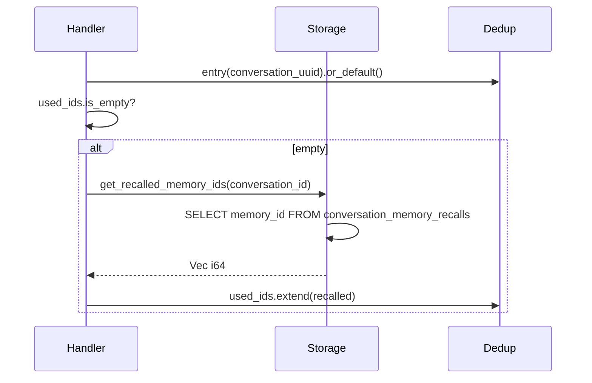

---

## 3. Deep Sleep cycle (background)

A single cycle processes all unprocessed conversations in batches. Each batch runs Step 1 → Step 2 → Step 3, then the watermark is advanced. The cycle ends when Step 1 returns an empty digest (no conversations with messages after the watermark).

### High-level cycle loop

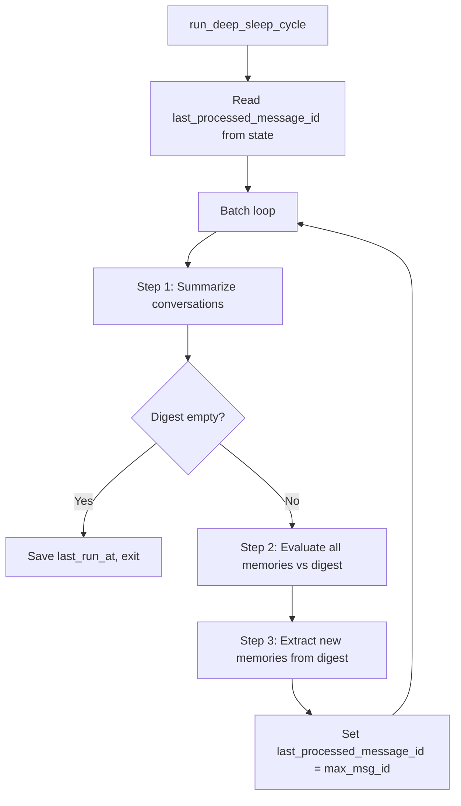

### Step 1: Summarize conversations

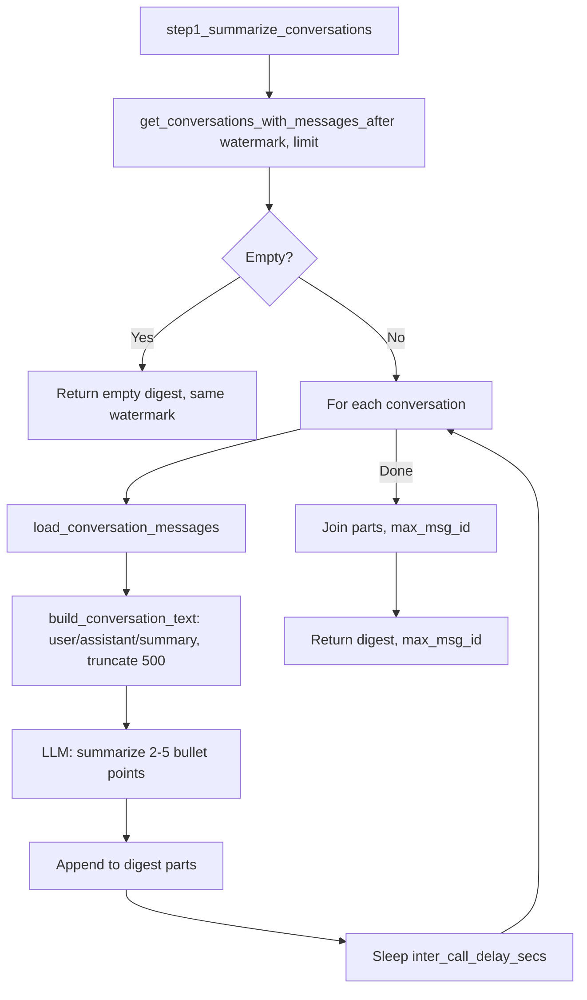

### Step 2: Evaluate memories

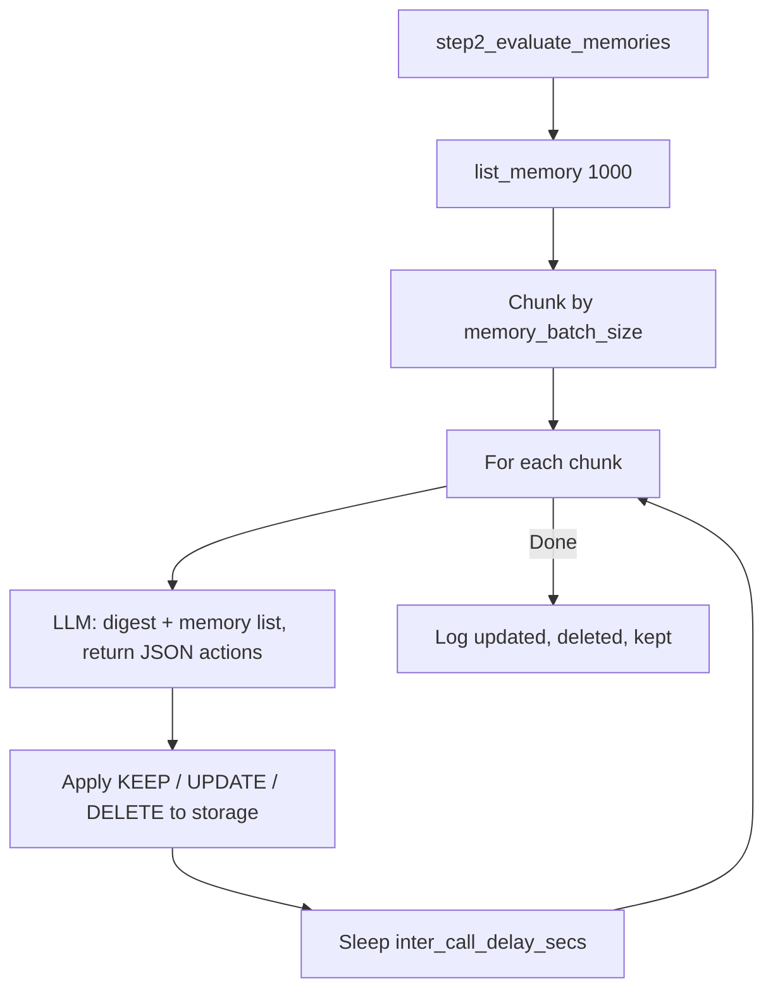

### Step 3: Extract new memories

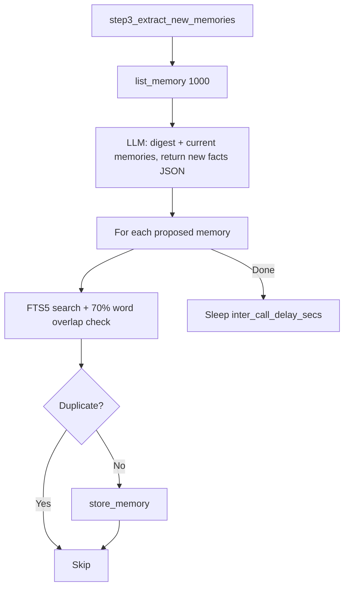

### Scheduler (when does it run?)

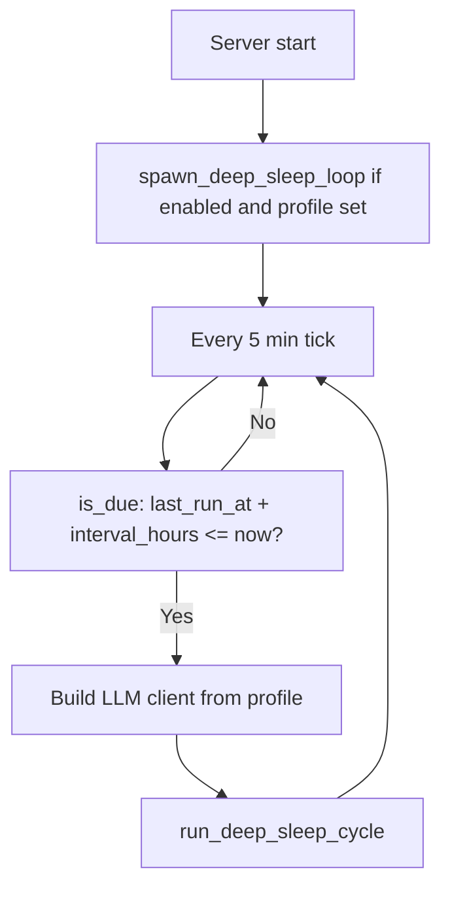

---

## 4. Manual Deep Sleep run

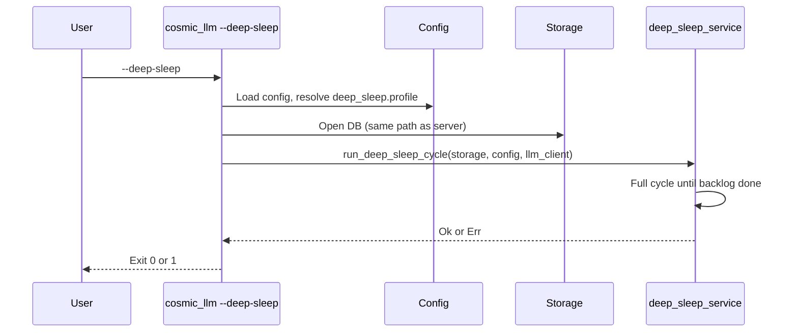

---

## 5. Data flow summary

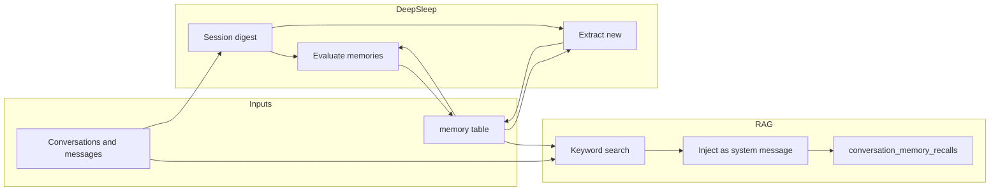
