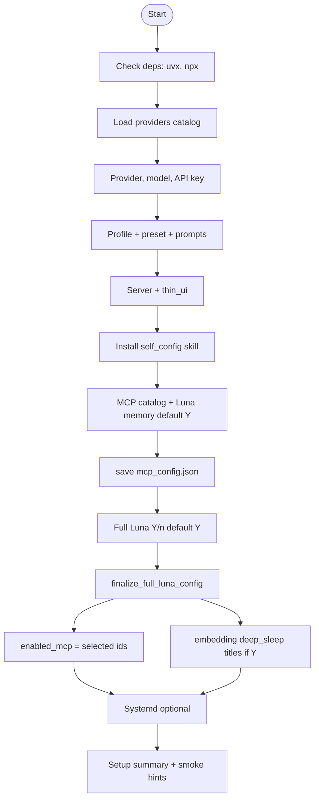

# Quick Setup – Flow Logic & Flaws

## Flow diagram (Mermaid)



---

## Historical flaws (fixed)

| Id | Was | Fix |
|----|-----|-----|
| **P0** | `enabled_mcp = []` while MCP JSON written | `finalize_full_luna_config` sets explicit server ids after MCP selection |
| **P0** | No `[embedding]` / `[deep_sleep]` | Full Luna step (default on) writes both |
| **F1** | Empty API key silent | Warn for non-ollama backends |
| **F4** | Port not validated | `_clamp_port` 1–65535 |
| **F5** | thin_ui localhost for 0.0.0.0 | Documented + runtime message |
| **F6** | Missing MCP catalog silent | Clear messages when catalog missing/empty |
| **F8** | Duplicate MCP picks | `dict.fromkeys` dedupe |

---

## Flow overview (linear)

```
  START → deps → provider/model/key → profile/preset → server/thin_ui
    → self_config skill → MCP pick + Luna memory [Y/n] → mcp_config.json
    → Full Luna [Y/n] → finalize (enabled_mcp + embedding + deep_sleep + titles)
    → systemd [Y/n] → setup summary
```

---

## Remaining limitations (by design or follow-up)

| Topic | Notes |
|-------|--------|
| **F5** | Remote thin UI still requires editing `server_config.toml` when server binds `0.0.0.0` |
| **Gemini endpoint** | Catalog uses API base URL; verify with `GeminiClient` if issues arise |
| **Health probe** | No automatic post-setup HTTP/MCP connection test |
| **Brave / Ollama** | Not in catalog |
| **Deb package** | Rebuild with `packaging/build_debs.sh` after changes (rsyncs `quick_setup/`) |
