# Quick Setup – Flow Logic & Flaws

## Flow diagram (Mermaid)

```mermaid
flowchart TD
    START([Start]) --> DEPS[Check deps: uvx, npx]
    DEPS --> DEPS_OK{Deps OK?}
    DEPS_OK -->|No| CONTINUE{Continue anyway?}
    CONTINUE -->|No| EXIT1([Exit 1])
    CONTINUE -->|Yes| LOAD_CAT
    DEPS_OK -->|Yes| LOAD_CAT[Load providers catalog]
    LOAD_CAT --> LOAD_CAT_FAIL{Catalog exists?}
    LOAD_CAT_FAIL -->|No| EXIT2([FileNotFoundError])
    LOAD_CAT_FAIL -->|Yes| ASK_PROV[Ask: Provider]
    ASK_PROV --> ASK_MOD[Ask: Model]
    ASK_MOD --> ASK_KEY[Ask: API key]
    ASK_KEY --> F1[(⚠ F1: Empty API key never validated)]
    F1 --> ASK_PERS[Ask: Personality]
    ASK_PERS --> ASK_TEMP[Ask: Temperature, Max tokens]
    ASK_TEMP --> ASK_PNAME[Ask: Profile name]
    ASK_PNAME --> INSTALL_PROMPT[Install system prompt + profile prompt from persona]
    INSTALL_PROMPT --> PERSONA_EXISTS{persona_path.exists?}
    PERSONA_EXISTS -->|No| F2[⚠ F2: Still set profile_prompt_file to profiles/name.md]
    PERSONA_EXISTS -->|Yes| WRITE_PROMPTS[Write system_prompt.md + profiles/name.md]
    F2 --> WRITE_PROFILE
    WRITE_PROMPTS --> WRITE_PROFILE[add_or_update_profile: write config.toml]
    WRITE_PROFILE --> F3[(⚠ F3: Profile may reference missing file)]
    F3 --> ASK_SERVER[Ask: Server host, port, api_key]
    ASK_SERVER --> F4[(⚠ F4: Port not validated 1-65535)]
    F4 --> MERGE_SERVER[merge_server_into_config]
    MERGE_SERVER --> WRITE_THIN[write_thin_ui_server_config]
    WRITE_THIN --> F5[(⚠ F5: host=0.0.0.0 → thin_ui gets localhost only)]
    F5 --> ASK_MCP[Ask: MCP servers from catalog]
    ASK_MCP --> MCP_CAT_EXISTS{MCP catalog / servers?}
    MCP_CAT_EXISTS -->|Empty| F6[⚠ F6: Returns empty, no message that catalog missing]
    MCP_CAT_EXISTS -->|Yes| PICK_MCP[User picks servers + optional Luna memory]
    F6 --> MCP_WRITE
    PICK_MCP --> MCP_WRITE{selected_ids or add_luna_memory?}
    MCP_WRITE -->|Yes| SAVE_MCP[save_mcp_config]
    MCP_WRITE -->|No| DONE
    SAVE_MCP --> DONE[Print paths & Done]
```



---

## Flaw summary table

| Id | Severity | Description | Where |
|----|----------|-------------|--------|
| **F1** | Medium | **Empty API key** – No check or warning. Profile is written with `api_key = ""`; Luna will fail at runtime for providers that require a key. | After `_ask_api_key`, before writing profile |
| **F2** | High | **Profile prompt file set but not created** – If `persona_path.exists()` is false (e.g. `sample_data/` missing or wrong `_sample_data_root()`), we never call `install_system_prompt` or `install_persona_as_profile_prompt`, but we still set `profile_prompt_file = "profiles/{profile_name}.md"` and write the profile. Profile points to a file that doesn’t exist. | main.py L222–226, L239 |
| **F3** | High | **Profile can reference missing file** – Same as F2: config is written with `profile_prompt_file` even when that file was never created. Luna may warn or fail when loading the profile. | profile_creator + main |
| **F4** | Low | **Port not validated** – `port` is not clamped to 1–65535. User could enter 0 or 99999; invalid value is written to config. | _ask_server, merge_server_into_config |
| **F5** | Low / Design | **Thin UI host always localhost when bind is 0.0.0.0** – For remote access, thin_ui would need the real hostname/IP; we always pass `localhost` when server host is `0.0.0.0`. Same-machine only. | main.py L251 |
| **F6** | Medium | **Missing MCP catalog is silent** – If `catalog/mcp_servers.json` is missing or has no `servers`, `_ask_mcp_servers_from_catalog` returns `([], False, None)` and we print "Skipped MCP servers." User is not told that the catalog was missing or empty. | _ask_mcp_servers_from_catalog, run() |
| **F7** | Low | **Catalog load after deps** – If `providers_models.json` is missing, we raise `FileNotFoundError` only after (optionally) installing deps and asking "Continue anyway?". Could load catalog earlier to fail fast. | run() order |
| **F8** | Trivial | **Duplicate choices in MCP list** – User can enter "1,1,2"; we don’t dedupe. Result is still correct (dict overwrites), but the list is redundant. | _ask_mcp_servers_from_catalog |

---

## Flow overview (linear)

```
  START
    │
    ▼
  Check deps (uvx, npx) ──► [Continue?] ──► Load providers catalog ──► [fail if missing]
    │
    ▼
  Ask: Provider → Model → API key  ──► (F1: no API key check)
    │
    ▼
  Ask: Personality → Temperature → Max tokens → Profile name
    │
    ▼
  Install prompts from persona
    │
    ├── persona_path.exists()? ──► YES: write system_prompt.md + profiles/<name>.md
    │
    └── NO ──► (F2/F3) still set profile_prompt_file = "profiles/<name>.md"
    │
    ▼
  Write profile to config.toml (add_or_update_profile)
    │
    ▼
  Ask: Server host, port, api_key  ──► (F4: port not validated)
    │
    ▼
  Merge [server] into config.toml + write thin_ui server_config.toml  ──► (F5: localhost)
    │
    ▼
  Ask: MCP servers (from catalog)  ──► (F6: empty catalog → silent)
    │
    ▼
  If any selected: merge_mcp_servers + save_mcp_config
    │
    ▼
  Print paths & Done
```

---

## Recommended fixes (concise)

| Fix | Status |
|-----|--------|
| **F2/F3** – Only set `profile_prompt_file` when we actually installed the file | ✅ Done: set only when persona_path.exists(); else warn and leave unset |
| **F1** – Warn when `api_key` is empty for backends that require it | ✅ Done: warn after asking API key (except ollama) |
| **F6** – If MCP catalog missing/empty, print clear message | ✅ Done: "MCP catalog not found..." / "MCP catalog is empty..." |
| **F8** – Dedupe MCP selected_ids | ✅ Done: list(dict.fromkeys(...)) |
| **F4** – Validate port 1–65535 | ✅ Done: _clamp_port in main + server_config; user port adjusted with message |
| **F5** – Document or ask re thin_ui host | ✅ Done: runtime message when host=0.0.0.0; README documents remote edit |
| **F7** – Load catalogs earlier to fail fast | ✅ Done: _load_catalog() right after deps output, before "Continue anyway?" |
