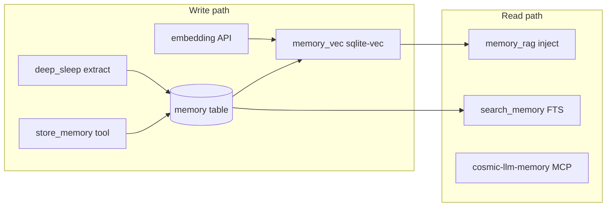

# Luna Memory Architecture

Luna uses **three complementary memory layers**. Quick setup enables all of them by default (“Full Luna”).

## Layers

| Layer | Mechanism | Config | When active |
|-------|-----------|--------|-------------|
| **Curated facts** | `store_memory` / `search_memory` tools + SQLite `memory` table | Always (internal tools) | Every agent run with tools allowed |
| **Semantic recall (RAG)** | `memory_rag` injects relevant memories into context | `[embedding] enabled = true` | Server startup + each message when embedding provider works |
| **Conversation history MCP** | `cosmic-llm-memory` MCP server (`mcp_luna_history`) | `mcp_config.json` + id in `tools_policies.*.enabled_mcp` | MCP connected and policy allows server |
| **Background maintenance** | Deep sleep cycle (summarize, evaluate, extract memories) | `[deep_sleep] enabled = true`, `profile = "..."` | Server background loop |



## Embedding (`[embedding]`)

Quick setup writes (when Full Luna is enabled):

```toml
[embedding]
enabled = true
endpoint = "https://api.openai.com/v1/embeddings"
model = "text-embedding-3-small"
dimensions = 1536
api_key = "..."   # chat key for OpenAI/DeepSeek/OpenRouter; separate key for Claude/Gemini chat
```

- Creates `memory_vec` virtual table (dimension must match `dimensions`).
- **Memory RAG** builds a query from recent user turns, embeds it, searches `memory_vec`, injects top memories into the prompt.
- **Attachment RAG** uses the same embedding provider for large document chunks (`search_attachment_chunks`).
- Fallback: `OPENAI_API_KEY` env if `api_key` is empty.

Manual maintenance:

```bash
cosmic_llm --reorganize-memories   # rebuild all memory vectors (embedding must be enabled)
```

## Deep sleep (`[deep_sleep]`)

```toml
[deep_sleep]
enabled = true
profile = "your_default_profile"   # LLM used for summarization / memory evaluation
# interval_hours, memory_batch_size, etc. use server defaults if omitted
```

Per cycle: summarize new conversations → evaluate existing memories → extract new memories. Re-embeds stored memories when embedding is active.

Manual run:

```bash
cosmic_llm --deep-sleep
```

## MCP: cosmic-llm-memory

Not in the no-setup catalog; quick setup adds it by default (`[Y/n]`).

- Binary: `~/.local/share/cosmic_llm/bin/mcp_luna_history` (auto-download from [mcp_luna_memory release](https://github.com/digit1024/mcp_luna_memory/releases/download/1.0/mcp_luna_history))
- Env: `COSMIC_LLM_DB_PATH` → `conversations.db`
- Policy: server id `cosmic-llm-memory` must appear in `tools_policies.<policy>.enabled_mcp`

**Critical:** Writing `mcp_config.json` alone is not enough — `enabled_mcp` must list the server id or MCP tools stay disabled.

## Tools policy

```toml
[tools_policies.default]
enabled_mcp = ["shell", "filesystem", "fetch", "skills", "markitdown", "cosmic-llm-memory"]
enabled_tools = ["*"]
disabled_tools = []
```

Glob patterns supported (`mem*`, `*` for all connected servers). Quick setup uses **explicit ids** from your MCP picker.

## Database

| Table / object | Purpose |
|----------------|---------|
| `memory` | Curated fact rows (content, category, importance) |
| `memory_fts` | FTS5 index for keyword `search_memory` |
| `memory_vec` | Vector index (when embedding enabled) |
| `deep_sleep_state` | Last run timestamps / checkpoints |
| `conversations` / `messages` | Full chat history (also used by history MCP) |

## Quick setup defaults

`luna-quick-setup` / `python -m quick_setup.main`:

1. MCP catalog servers → `mcp_config.json`
2. Luna memory MCP → default **on**
3. Full Luna → default **on** → `[embedding]`, `[deep_sleep]`, `[title_summary]`
4. `finalize_full_luna_config` → `enabled_mcp` matches selection

See [QUICK_SETUP.md](QUICK_SETUP.md) for the full flow.
