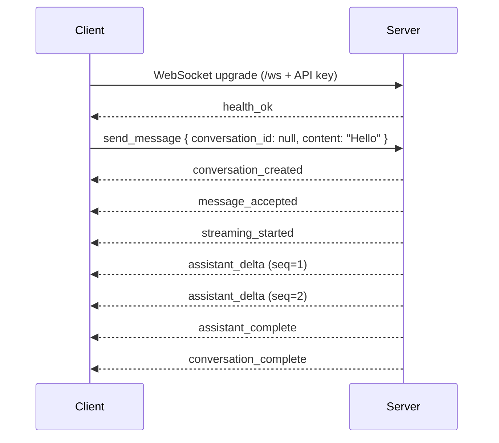

## Luna Server Compatibility Spec (v1)

This document defines the **wire-level contract** between a Luna-compatible server and any thin client (desktop, mobile, or web) such as `luna_thin_ui` or the Flutter mobile app.

The goal is that **any server implementation that follows this spec** can be dropped in behind the existing clients with **no client changes**.

---

## 1. Transport & Authentication

- **Single logical server**
  - Exposes **HTTP** for REST-style operations (file upload, metadata).
  - Exposes **WebSocket** for real-time chat.

- **Base URLs**
  - HTTP base: `http://{host}:{port}`
  - WebSocket base:
    - Preferred: `wss://{host}:{port}/ws`
    - Fallback: `ws://{host}:{port}/ws`

### 1.1 API Key Authentication

All non-public endpoints are protected by a shared **API key** string.

- **HTTP requests** (required – both headers should be accepted):
  - `x-api-key: <API_KEY>`
  - `authorization: Bearer <API_KEY>`

- **WebSocket handshake**
  - The client sends the same headers on the WebSocket upgrade request:
    - `x-api-key: <API_KEY>`
    - `authorization: Bearer <API_KEY>`
  - The server **must reject** connections where the key does not match:
    - HTTP status: `401 Unauthorized` for the upgrade request.

- **Static file endpoint** (section 3.3) embeds the API key in the URL path instead of headers.

---

## 2. WebSocket Chat Protocol

- **URL**: `/ws` relative to the HTTP base.
- **Framing**: UTF‑8 text frames only; **no binary frames** are required for compatibility.
- **Content type**: Each frame is a single JSON object.
- **Message shape (both directions)**:
  - Top-level `"type"` field (string, `snake_case`) selects the variant.
  - Additional fields depend on the variant.

The protocol consists of:

- **Client → Server**: `ClientCommand`
- **Server → Client**: `ServerEvent`

All field names and variant names below are **normative** – a clone must follow them exactly.

### 2.1 Connection Lifecycle

- After a successful WebSocket upgrade, the server must **immediately behave as if it received**:

```json
{ "type": "health_check" }
```

- It should therefore send a `health_ok` event (see 2.3.1) without the client needing to send the command first.

- The server should:
  - Support **Ping/Pong** frames.
  - Close the connection cleanly when unrecoverable errors occur, ideally after sending a `error` event.

### 2.2 Client → Server: `ClientCommand`

Common rules:

- `conversation_id` and `message_id` are opaque **string** identifiers (UUIDs in the reference implementation) that the client must treat as strings.
- All timestamps are **Unix epoch seconds (i64)**.

#### 2.2.1 HealthCheck

```json
{ "type": "health_check" }
```

- Purpose: verify connectivity and get the current profile name.
- Expected response: `health_ok`.

#### 2.2.2 StartConversation

```json
{
  "type": "start_conversation",
  "title": "Optional initial title or preview" // or null
}
```

- `title`:
  - If `null` or omitted, server should synthesize a title (e.g. `"Generating title..."`).
- Expected response:
  - `conversation_created` (see 2.3.4).
  - The client may then send `load_conversation`.

#### 2.2.3 LoadConversation

```json
{
  "type": "load_conversation",
  "conversation_id": "<conversation-id>"
}
```

- Expected responses:
  - On success: `conversation_loaded` (full conversation view).
  - On error (nonexistent / invalid ID): `error`.

#### 2.2.4 ListConversations

```json
{
  "type": "list_conversations",
  "query": "optional search text",  // or null
  "limit": 50,                      // optional, default implementation uses ~240
  "offset": 0                       // optional, pagination offset
}
```

- Behavior:
  - If `query` is non-empty: perform a **full-text search** and return `search_results`.
  - Otherwise: paginate the whole conversation list and return `conversations_list`.

#### 2.2.5 DeleteConversation

```json
{
  "type": "delete_conversation",
  "conversation_id": "<conversation-id>"
}
```

- On success: `conversation_deleted`.
- On missing/invalid ID: `error`.

#### 2.2.6 TruncateConversation

```json
{
  "type": "truncate_conversation",
  "conversation_id": "<conversation-id>",
  "message_id": "<message-id>"
}
```

- Semantics:
  - Permanently delete **all messages up to and including** `message_id`.
  - Reload the conversation and send a fresh `conversation_loaded`.

#### 2.2.7 StopStreaming

```json
{
  "type": "stop_streaming",
  "conversation_id": "<conversation-id>" // or null/omitted
}
```

- Semantics:
  - Abort any in-flight LLM/tool work started from this connection.
  - Emit `streaming_stopped` (and optionally broadcast it to other viewers of the conversation).

#### 2.2.8 SummarizeConversation

```json
{
  "type": "summarize_conversation",
  "conversation_id": "<conversation-id>"
}
```

- Semantics:
  - Force a manual summarization / compaction of conversation history.
  - After completion:
    - Should emit `info` (e.g. `"Conversation summarized."`).
    - Should emit an updated `conversation_loaded`.

#### 2.2.9 ChangeProfile

```json
{
  "type": "change_profile",
  "profile": "<profile-name>"
}
```

- Semantics:
  - Switch the active LLM/profile for this connection.
  - On success, emit `profile_changed`.
  - The active conversation (if any) should persist its new profile to storage.

#### 2.2.10 ListProfiles

```json
{ "type": "list_profiles" }
```

- Response: `profiles_list` containing all visible profiles plus the default name.

#### 2.2.11 SendMessage

```json
{
  "type": "send_message",
  "conversation_id": "<conversation-id-or-null>",
  "content": "User message text"
}
```

- Rules:
  - `content` must be non-empty after trimming; otherwise respond with `error`.
  - If `conversation_id` is:
    - **Present**: append message to that conversation (and ensure its stored profile matches the active profile).
    - **Missing / null**: create a new conversation with a generated title and emit `conversation_created`.

- Expected event sequence for a normal successful turn:

1. `message_accepted`
2. `streaming_started`
3. Zero or more `assistant_delta` (and optionally `reasoning_content_delta`)
4. `assistant_complete`
5. `conversation_complete`

The server may also emit `info` events before/after summarization or truncation.

---

### 2.3 Server → Client: `ServerEvent`

Below are the events emitted by the reference implementation. A compatible server must emit the **same shapes and names**; extra fields are allowed but should be optional for clients.

#### 2.3.1 HealthOk

```json
{
  "type": "health_ok",
  "timestamp": 1730000000,
  "profile": "default"
}
```

#### 2.3.2 Error

```json
{
  "type": "error",
  "message": "Human-readable error message"
}
```

#### 2.3.3 Info

```json
{
  "type": "info",
  "message": "Information about summarization, truncation, etc."
}
```

#### 2.3.4 ConversationCreated

```json
{
  "type": "conversation_created",
  "conversation_id": "<conversation-id>"
}
```

#### 2.3.5 ConversationLoaded

```json
{
  "type": "conversation_loaded",
  "conversation": {
    "id": "<conversation-id>",
    "title": "Title",
    "created_at": 1730000000,
    "updated_at": 1730000100,
    "messages": [ /* MessageView[] – see below */ ],
    "profile_name": "optional-profile-name-or-null"
  }
}
```

`MessageView` shape:

```json
{
  "id": "<message-id>",
  "role": "user | assistant | system | tool",
  "content": "Text content (may be empty for tool_result messages)",
  "timestamp": 1730000000,
  "tool_calls": [ /* optional, ToolCallView[] */ ],
  "tool_call_id": "optional-tool-call-id",
  "tool_name": "optional-tool-name",
  "tool_status": "optional-status-string",
  "tool_params_json": {},          // optional JSON
  "tool_result_json": {},          // optional JSON
  "attachments": [ /* optional, AttachmentView[] */ ],
  "reasoning_content": "optional LLM reasoning text",
  "is_summary": false,
  "summarized_count": 0            // optional
}
```

`AttachmentView`:

```json
{
  "file_id": "<server-internal-id>",
  "file_name": "example.pdf",
  "mime_type": "application/pdf",
  "file_size": 123456
}
```

#### 2.3.6 ConversationsList

```json
{
  "type": "conversations_list",
  "conversations": [
    {
      "id": "<conversation-id>",
      "title": "Title",
      "last_message_preview": "First 60 chars…",
      "updated_at": 1730000000
    }
  ]
}
```

#### 2.3.7 SearchResults

```json
{
  "type": "search_results",
  "results": [
    {
      "conversation_id": "<conversation-id>",
      "snippet": "Matched snippet text",
      "timestamp": 1730000000,
      "rank": 0.95
    }
  ]
}
```

#### 2.3.8 ProfileChanged & ProfilesList

```json
{ "type": "profile_changed", "profile": "new-profile-name" }
```

```json
{
  "type": "profiles_list",
  "profiles": ["default", "coding", "research"],
  "default_profile": "default"
}
```

#### 2.3.9 MessageAccepted

```json
{
  "type": "message_accepted",
  "conversation_id": "<conversation-id>",
  "message_id": "<message-id>"
}
```

#### 2.3.10 StreamingStarted / StreamingStopped

```json
{
  "type": "streaming_started",
  "conversation_id": "<conversation-id>"
}
```

```json
{
  "type": "streaming_stopped",
  "conversation_id": "<conversation-id-or-\"unknown\">"
}
```

#### 2.3.11 AssistantDelta / ReasoningContentDelta / AssistantComplete

```json
{
  "type": "assistant_delta",
  "conversation_id": "<conversation-id>",
  "chunk": "partial text chunk",
  "seq": 1
}
```

```json
{
  "type": "reasoning_content_delta",
  "conversation_id": "<conversation-id>",
  "chunk": "partial reasoning chunk"
}
```

```json
{
  "type": "assistant_complete",
  "conversation_id": "<conversation-id>",
  "content": "full assistant message",
  "reasoning_content": "optional full reasoning text or null"
}
```

#### 2.3.12 ToolPlanned / ToolStarted / ToolResult / ToolError

```json
{
  "type": "tool_planned",
  "conversation_id": "<conversation-id>",
  "tools": [
    {
      "id": "<tool-call-id>",
      "name": "tool_name",
      "params_json": { "param": "value" }
    }
  ]
}
```

```json
{
  "type": "tool_started",
  "conversation_id": "<conversation-id>",
  "tool_call_id": "<tool-call-id>",
  "name": "tool_name",
  "params_json": { "param": "value" }
}
```

```json
{
  "type": "tool_result",
  "conversation_id": "<conversation-id>",
  "tool_call_id": "<tool-call-id>",
  "name": "tool_name",
  "result_json": { /* arbitrary JSON result */ }
}
```

```json
{
  "type": "tool_error",
  "conversation_id": "<conversation-id>",
  "tool_call_id": "<tool-call-id>",
  "name": "tool_name",
  "error": "error text"
}
```

#### 2.3.13 ConversationComplete / ConversationDeleted

```json
{
  "type": "conversation_complete",
  "conversation_id": "<conversation-id>"
}
```

```json
{
  "type": "conversation_deleted",
  "conversation_id": "<conversation-id>"
}
```

---

### 2.4 WebSocket Sequence Example

Mermaid sequence diagram for a typical chat turn with a new conversation:



---

## 3. HTTP API

Base URL: `http://{host}:{port}`

All endpoints except `static` use **header-based API key auth** (section 1.1).

### 3.1 POST `/api/attach-file`

- **Auth**: required API key headers.
- **Content-Type**: `multipart/form-data; boundary=...`
- **Form fields**:
  - `file`: the binary file data (required).
  - `conversation_id`: optional string; if present, used to group uploads under that conversation.

#### 3.1.1 Response: 200 OK

```json
{
  "uid": "<file-uid>",
  "original_name": "myfile.pdf",
  "stored_path": "/full/path/on/server/config/uploads/<uid>.pdf"
}
```

- `uid` is used later to remove the file via `DELETE /api/attach-file/{uid}`.
- `stored_path` is informational (server-local path); UI does **not** rely on a specific format beyond being a string.

#### 3.1.2 Error responses

- `400 Bad Request`:
  - Missing or invalid multipart data.
  - Missing `file` field.
- `401 Unauthorized`:
  - Missing or incorrect API key.
- `500 Internal Server Error`:
  - Disk write errors, etc.

### 3.2 DELETE `/api/attach-file/{uid}`

- **Auth**: required API key headers.
- **Path parameter**:
  - `uid`: the `uid` returned from `POST /api/attach-file`.

#### 3.2.1 Response: 200 OK

```json
{
  "success": true
}
```

- `success` is `true` if at least one matching file was removed, `false` otherwise.

### 3.3 GET `/api/mcp-servers`

- **Auth**: required API key headers.
- **Purpose**: allow UI to inspect the currently configured MCP servers and their tool counts.

#### 3.3.1 Response: 200 OK

```json
{
  "servers": [
    {
      "name": "filesystem",
      "tool_count": 5,
      "status": "connected"
    },
    {
      "name": "calendar",
      "tool_count": 0,
      "status": "failed",
      "error": "Connection refused"
    }
  ]
}
```

- The `status` field is a tagged enum:
  - `"connected"`
  - `"failed"` with an additional `error` string.

### 3.4 GET `/api/static/{api_key}/{*path}`

Static file serving for UI assets (e.g. images).

- **Auth**: API key is supplied as the first path segment:
  - `api_key` must equal the configured shared API key; otherwise respond with `401 Unauthorized`.
- **Path parameter**:
  - `path`: relative path under the server’s static directory.

Rules:

- Reject:
  - Empty paths.
  - Paths containing `..` (directory traversal).
- Files are served from a configured static root (e.g. `config_dir/static`).
- A valid request:
  - Must resolve under the static root.
  - Must point to a regular file.

#### 3.4.1 Response: 200 OK

- Body: raw file bytes.
- Headers:
  - `Content-Type`: guessed via file extension (e.g. `image/png`, `text/plain`, etc.).

#### 3.4.2 Error responses

- `401 Unauthorized`: API key path segment does not match.
- `404 Not Found`: file missing, outside static root, or not a regular file.
- `500 Internal Server Error`: read failures.

---

## 4. Versioning & Extensibility Guidelines

For server implementations that intend to remain compatible with existing clients:

- **Do not break existing variants or field names.**
- You may:
  - Add **new `type` variants** (clients that do not know them will ignore them).
  - Add **new optional fields** to existing variants.
- Clients should:
  - Ignore unknown fields.
  - Fail gracefully on unknown `type` values (e.g. log + ignore).

---

## 5. Checklist for Implementing a Compatible Clone

- **Transport**
  - [ ] HTTP server on `http://{host}:{port}`
  - [ ] WebSocket endpoint at `/ws`

- **Authentication**
  - [ ] Shared API key configured.
  - [ ] HTTP: accept both `x-api-key` and `authorization: Bearer <API_KEY>`.
  - [ ] WebSocket: validate same headers on upgrade.

- **WebSocket protocol**
  - [ ] Implement all `ClientCommand` variants in 2.2.
  - [ ] Emit all `ServerEvent` variants in 2.3 with matching shapes.
  - [ ] On connect, send `health_ok` automatically.
  - [ ] Implement the streaming lifecycle for `send_message`.

- **HTTP endpoints**
  - [ ] `POST /api/attach-file`
  - [ ] `DELETE /api/attach-file/{uid}`
  - [ ] `GET /api/mcp-servers`
  - [ ] `GET /api/static/{api_key}/{*path}`

If all boxes are checked, your server should be **drop-in compatible** with the existing thin UI and mobile app.

